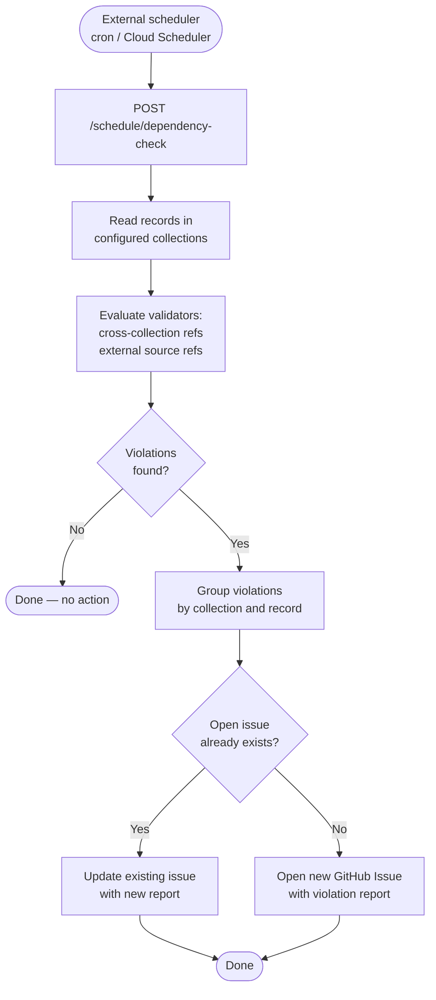

# Feature: Background Dependency Validation

**Dev plan:** [dependency-validation-dev-plan.md](./dependency-validation-dev-plan.md)

## Goal

Periodically scan an inGitDB repository to detect integrity violations that cannot be caught at
write time — for example, a record referencing an external ID that has since been deleted, or a
cross-collection reference that points to a record that no longer exists. When violations are
found, the App opens a GitHub Issue in the repository with a structured report.

This feature runs independently of PRs and requires no user action to trigger beyond installing
the App and configuring a scheduler.

---

## Why not a GitHub Actions workflow?

A scheduled GitHub Actions workflow could run `ingitdb validate` on a timer, but it runs inside
the repository's own context and is subject to Actions usage limits. The GitHub App runs the
check externally, acts as its own identity when opening issues, and can be configured centrally
across many repositories without each repository needing to maintain workflow YAML.

---

## Validation Types

### Cross-collection references

A record in collection A contains a field that references a record ID in collection B. The App
verifies that the referenced record exists.

```yaml
# .ingitdb.yaml collection definition example
collections:
  daily_standups:
    columns:
      author:
        type: ref
        ref_collection: users   # every author value must exist as a record ID in users
```

### External source references

A record field references an ID in an external system (e.g., a Jira ticket ID, a GitHub issue
number, a user ID from an identity provider). The App calls the external source to verify the
ID is still valid.

```yaml
collections:
  retrospectives:
    columns:
      jira_ticket:
        type: external_ref
        source: jira             # named external source defined in github_app.external_sources
```

### Custom validators (future)

A collection can declare a custom validation endpoint. The App POSTs record data to the endpoint
and expects a pass/fail response with optional error details.

---

## Configuration

```yaml
github_app:
  dependency_validation:
    # Collections to include. Omit to check all collections.
    collections:
      - daily_standups
      - retrospectives

    # Named external sources for external_ref field validation.
    external_sources:
      jira:
        type: jira_cloud
        base_url: https://myorg.atlassian.net
        # Credentials read from environment: INGITDB_EXT_JIRA_TOKEN
        token_env: INGITDB_EXT_JIRA_TOKEN

      github_issues:
        type: github
        # Uses the App's own installation token; no extra credentials needed.

    # GitHub Issue settings.
    issues:
      assignees:
        - github_login: alice
      labels:
        - ingitdb-validation
        - automated
```

---

## Flow



---

## GitHub Issue Format

The App opens or updates a single issue per repository per check run. Updating rather than
opening a new issue on each run avoids issue spam and gives a clear history of when violations
appeared and were resolved.

```markdown
## inGitDB Dependency Validation Report

Last checked: {ISO 8601 datetime}

### cross-collection references

**`daily_standups`** — 2 violations:
- Record `2024-03-01-alice`: field `author` references `users/charlie` — record not found
- Record `2024-03-05-bob`: field `author` references `users/dana` — record not found

### external references

**`retrospectives`** — 1 violation:
- Record `retro-q1-2024`: field `jira_ticket` = `PROJ-404` — ticket not found in Jira

---

_Opened automatically by the inGitDB GitHub App. Close this issue once all violations are
resolved; the App will reopen it if new violations are detected._
```

When all violations in a previously reported issue are resolved, the App posts a closing comment
and closes the issue automatically.

---

## GitHub App Permissions Required

In addition to the permissions used by [PR Auto-Merge](./pr-auto-merge-feature.md):

| Permission | Level | Required for |
|---|---|---|
| `issues` | write | Opening, updating, and closing validation report issues |
