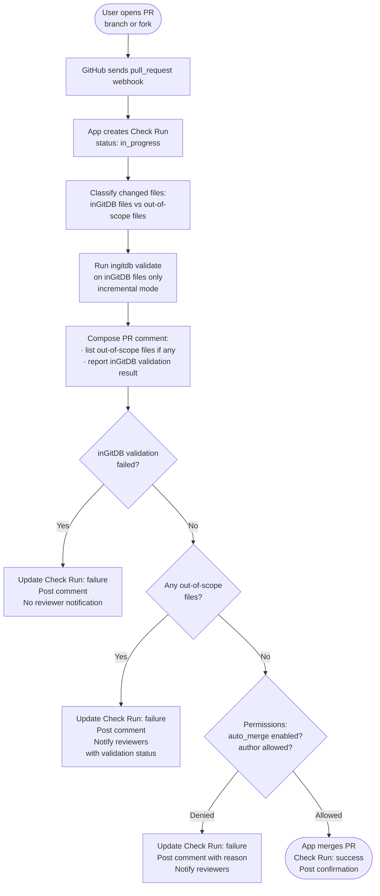
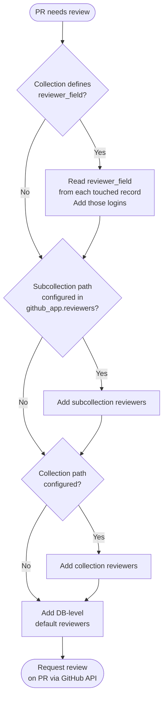

# Feature: PR Auto-Merge

**Dev plan:** [pr-auto-merge-dev-plan.md](./pr-auto-merge-dev-plan.md)

## Goal

When a user submits data via a PR, validate the changed records against the inGitDB schema and,
if permitted by the repository's permission model, merge the PR automatically.

This is the primary motivation for the GitHub App: GitHub Actions workflows from forked
repositories cannot merge PRs into the upstream repo due to GitHub's security model. The App
has its own permissions regardless of PR origin.

## Triggers

- Webhook event: `pull_request` with action `opened`, `synchronize`, or `reopened`
- Scheduled scan: periodic check for open PRs missed due to webhook delivery failures
  (see [Scheduling](#scheduling-backup-for-missed-webhooks))

---

## Flow



**Validation details:**
- Changed files are classified first: inGitDB-managed files are validated; out-of-scope files
  block auto-merge but do not skip validation of the inGitDB portion
- The PR comment always describes both dimensions: which out-of-scope files were found (if any)
  and whether the inGitDB changes passed or failed validation
- If inGitDB validation fails, no reviewer notification is sent — the author must fix the data
  first
- Validation errors are reported as Check Run annotations pointing to the specific file and field
- The PR author's identity is checked against the permission rules defined in `.ingitdb.yaml`

---

## PR Comment and Notification Content

Every PR comment posted by the App includes a structured change summary. The same summary is
included in reviewer notification messages.

### Summary template

```markdown
## Schema Changes

### Collections
- Added: `{collection-id}`, `{collection-id}`
- Removed: `{collection-id}`
- Updated:
  - `{collection-id}`: column `{field}` added (type: string, required)
  - `{collection-id}`: column `{field}` type changed (int → string), column `{field}` removed

### Views
- Added: `{view-id}`
- Removed: `{view-id}`
- Updated: `{view-id}` (definition changed)

---

## Data Changes

### Collections
- `{collection-id}`: 3 records added, 2 updated, 1 deleted
- `{collection-id}`: 1 record added

### Views (materialized)
- `{view-id}`: 3 records added, 1 updated, 2 deleted

---

## Commits
- `{short-sha}` {commit message} — {author} ({date})
- `{short-sha}` {commit message} — {author} ({date})

---

## Validation

> Passed  ✓

<!-- or, if failed: -->

> Failed  ✗
>
> - `{file-path}` line {N}: {error description}
> - `{file-path}` line {N}: {error description}

---

## Out-of-scope Files

The following files are not managed by inGitDB and prevent automatic merging:
- `{file-path}`
- `{file-path}`

A reviewer has been notified.
```

### Omission rules

Sections with nothing to report are omitted entirely. If the PR contains only data changes, the
**Schema Changes** section is not rendered. The **Out-of-scope Files** section appears only when
such files are present. The **Validation** section always appears when there are inGitDB files in
the PR.

### Merge confirmation comment

When the App successfully merges a PR, it posts a shorter confirmation comment containing the
change summary without the validation errors or out-of-scope sections.

---

## Permission Model

Permission rules are defined in the repository's `.ingitdb.yaml` under a `github_app` key.

### Example configuration

```yaml
github_app:
  pr_merge:
    # Default: require a human review before merging.
    # Can be overridden per collection.
    default:
      auto_merge: false

    collections:
      daily_standups:
        # Automatically merge if validation passes and the author rule is satisfied.
        auto_merge: true
        # The GitHub login of the PR author must match the value of the record's
        # author field. Prevents users from submitting data on behalf of others.
        author_must_match_field: author

      retrospectives:
        auto_merge: true
        # Any member of the GitHub team "team-leads" may submit retrospectives.
        allowed_authors:
          - github_team: myorg/team-leads

      config:
        # Config collection requires a human review; never auto-merged.
        auto_merge: false
```

### Permission rule types

| Rule                      | Description                                                                           |
|---------------------------|---------------------------------------------------------------------------------------|
| `auto_merge: false`       | Never auto-merge; a human reviewer must approve and merge manually                    |
| `auto_merge: true`        | Merge automatically if validation passes and author rules are satisfied               |
| `author_must_match_field` | PR author's GitHub login must equal the specified field value in every changed record |
| `allowed_authors`         | Restrict PR authors to a list of GitHub logins or GitHub team members                 |

If no `github_app` key is present, the App validates but never merges (safe default).

### Subcollection inheritance

Permission rules defined on a collection apply to all of its subcollections unless the
subcollection defines its own rules. The most specific matching path wins.

Example: if `daily_standups` has `auto_merge: true`, then changes to `daily_standups/team-alpha/`
also auto-merge. If `daily_standups/team-alpha` explicitly sets `auto_merge: false`, that
overrides the parent rule for that subtree only.

---

## Allowed Path Scope

The App will only auto-merge a PR when **every changed file** falls within one of:
1. inGitDB-managed paths (any file under a collection directory tracked in
   `.ingitdb/root-collections.yaml`)
2. Directories explicitly listed in `github_app.pr_merge.allowed_dirs`

When out-of-scope files are present, the App still validates any inGitDB files in the same PR.
The PR comment always reports both:
- which out-of-scope files were found and that auto-merge is blocked because of them
- whether the inGitDB portion passed or failed validation (or that there are no inGitDB changes)

Reviewer notification is only sent when the inGitDB changes pass validation (or there are none).
If the inGitDB changes fail, the author must fix the data first; reviewers are not notified until
the data is valid.

```yaml
github_app:
  pr_merge:
    # Directories (relative to repo root) safe to auto-merge alongside inGitDB data.
    allowed_dirs:
      - docs/generated
      - public/data
```

This is a safety guarantee: the App can never silently merge code, workflow, or configuration
changes — only data.

---

## Review Notifications

When the App cannot auto-merge a PR (out-of-scope files, permission denied, or
`auto_merge: false`), it notifies the relevant reviewers by requesting their review on the PR
via the GitHub API.

Reviewers are resolved by specificity — the most specific matching scope wins, falling back to
broader scopes if no specific reviewer is configured.

### Reviewer scopes (most to least specific)

| Scope              | Configuration location          | Example path                    |
|--------------------|---------------------------------|---------------------------------|
| Specific record    | Field value in the record       | `collections/teams/team-alpha`  |
| Subcollection      | `github_app.reviewers` path     | `daily_standups/team-alpha`     |
| Collection         | `github_app.reviewers` path     | `daily_standups`                |
| DB-level (default) | `github_app.reviewers.default`  | (any unmatched path)            |



### Configuration example

```yaml
github_app:
  reviewers:
    default:
      - github_login: alice
      - github_team: myorg/db-owners

    paths:
      daily_standups:
        - github_login: bob
        - github_team: myorg/scrum-masters

      daily_standups/team-alpha:
        - github_login: carol

      config:
        - github_team: myorg/admins

  collections:
    daily_standups:
      auto_merge: true
      # Field whose value is the GitHub login of the record's assigned reviewer.
      reviewer_field: assigned_reviewer
```

### Record-level reviewers

If a collection defines `reviewer_field`, the App reads that field from each record touched by
the PR and adds those GitHub logins to the review request. This allows individual records to have
dedicated owners independent of who reviews the rest of the collection.

The `reviewer_field` value can be a single GitHub login string or a list of logins.

---

## Scheduling (Backup for Missed Webhooks)

Webhooks can be missed due to server downtime or delivery failures. As a safety net, the App
exposes a `POST /schedule/scan-open-prs` endpoint that:
1. Lists all open PRs in the repository
2. Checks whether each PR has a completed inGitDB Check Run
3. Re-triggers the full validation and merge flow for any PR that has not been processed

This endpoint is called by an external cron job (e.g., Cloud Scheduler, GitHub Actions scheduled
workflow) at a configurable interval (e.g., every 15 minutes).
